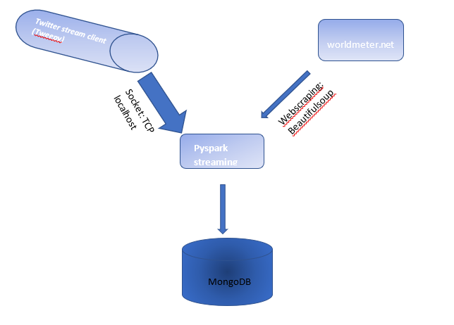

# Covid19 Live Stream To Database
This project is based on a senior data engineering interview question.

### Brief
The new coronavirus affects most of the industries on a global scale and creates an excessive
workload on customer support departments. To maintain customer support quality, most of the
companies started to adopt automated customer support solutions.\
Based on new coronavirus-like worldwide events, companies' data scientists are working on a new
machine learning models to improve thier business like a sales company will want to predict number of potential customers. To this end, data scientists and data analysts will need the
live tweets from Twitter and the number of total coronavirus cases from worldometer.info.

### Task
In this project I will be assuming the role of a data engineer whose task is to create a Python application that processes Twitter’s live tweet stream, fetches total coronavirus cases from worldometer.info, merges
tweet and coronavirus data, and finally, stores merged data into a MongoDB instance.

### Key Technology to be Used
* Python: We will be using the beautifulsoup and requests library for our webscraping task and for streaming tweets from Twitter we will be using the tweepy module. For more information on python, beautifulsoup and tweepy visit the below links
   * https://www.python.org/doc/essays/blurb/
   * https://pypi.org/project/beautifulsoup4/
   * https://docs.tweepy.org/en/stable/
   * socket: The socket module available in the python standard library was used to create a TCP stream where we can easily connect spark to read from

* Pyspark: We will be using the pyspark streaming service for processing our stream data. Read more on pypsark on https://spark.apache.org/docs/latest/api/python/

* MongoDB: We will be using the document based database system in this project. Read more on MongoDB on https://en.wikipedia.org/wiki/MongoDB

### Implementation Steps / Requirements
* Create a webscraping script using python that extracts the number of COVID19 cases reported so far from the worldmeter.info website. This will be acheived using the beautifulsoup and request library.
* Create a python streaming script that collects and process live tweets live tweets on covid19 (at that time) every 20 seconds
* The streaming technology to be used is the pyspark streaming service. The stream will also collect the number of covid19 cases every 20 seconds
* Clean and merge both data together in a transformation pipeline in the below format
>> {
"content": list_of_processed_tweets_in_current_batch,
"timestamp": timestamp,
"total_case_count": total_case_count
}

* The data is then loaded into a MongoDB

### How to run the Code
The project contains four(4) python scripts
* stream.py: This starts the streaming from twitter. It calls the stream class in the utility module. Run this module first. 
* scrape.py: This extracts the live number of covid 19 cases from the worldmeter website 
* utility.py: This contains implementation (function) of the streaming codes from twiiter, setting up TCP socket and sending message stream to TCP at localhost
* Spark_Streaming.py: This contains implementation of spark streaming pipeline and connection to MongoDB at localhost. This module should be run second after the `stream` module.

**Code modular dependency**
The `stream` module depends on the `utility` module.
The `Spark_Stream` module depends on the `scrape` module

stream.py and Spark_Stream.py are to be run on separated windows

**Note This projec was completed locally and all tools were setup on local machine**
